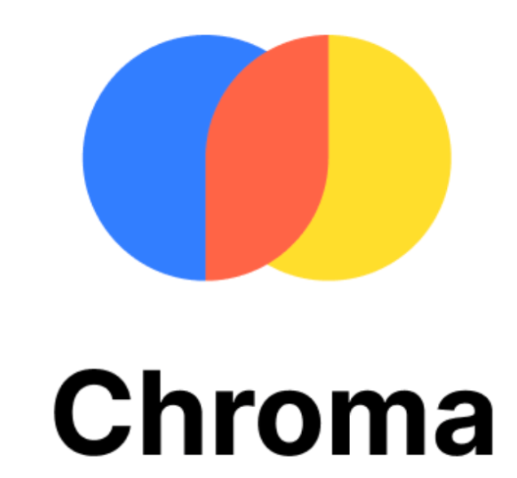

<h1 align="center">Hi 👋 I'm Hazem Waleed</h1>

  <strong>Senior AI Student | NLP • Deep Learning • LLMs • Agentic AI • AI in Healthcare</strong> 
  Building real-world AI solutions and NLP pipelines that solve real problems

---

### About Me
 
  Senior student at Faculty of Computer & AI, Cairo University  
  Passionate about Natural Language Processing (NLP) and Large Language Models (LLMs)  
  Currently focused on Retrieval-Augmented Generation (RAG) and Agentic AI  
  Exploring applied AI solutions and academic research opportunities  

---

### Programming Languages / Frameworks

  
  
  
  
  
  
  
  
  
  
  

---

### LLM Tooling & Engineering

  
  
  
  
  
  
  
  
  
  

---

### GitHub Stats

  

  

---

### Let's Connect

  
  
  
  

